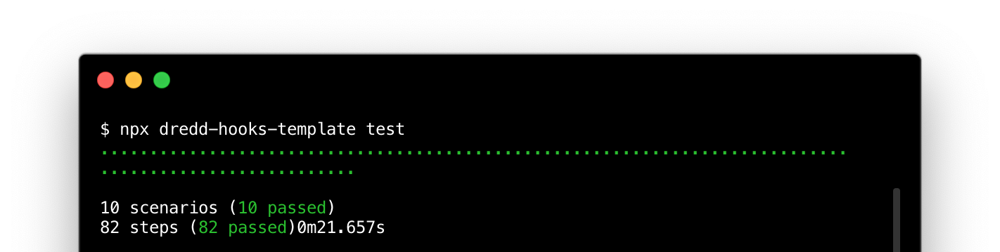

# Cross-Language Test Suite for Dredd Hooks Handlers

[](https://travis-ci.org/apiaryio/dredd-hooks-template)

[Dredd](https://dredd.org) is a tool for testing web APIs. It supports [hooks](http://dredd.org/en/latest/hooks/index.html) written in [many languages](http://dredd.org/en/latest/hooks/index.html#supported-languages). To support a particular language, it needs an adapter, so-called hooks handler. This [BDD](https://en.wikipedia.org/wiki/Behavior-driven_development) test suite ensures that the public interface of each hooks handler works as Dredd expects. The test suite is written in [Gherkin](https://github.com/cucumber/cucumber/wiki/Gherkin) and uses [Cucumber](https://github.com/cucumber/cucumber-js) as a test runner.

To use the test suite, first read the docs about [how to create a new hooks handler](http://dredd.org/en/latest/hooks/new-language.html) for Dredd. Implement your hooks handler and then continue with the following guide.

## Installation

1.  Make sure you have [Node.js](https://nodejs.org/) (ideally version 10 or higher) and [npm](https://www.npmjs.com/package/npm) available.
1.  Create a `package.json` file in the root of your project. This is where your JavaScript dependencies are going to be specified:

    ```json
    {
      "scripts": { "test": "dredd-hooks-template test" },
      "private": true
    }
    ```

1.  Run `npm install dredd-hooks-template --save-dev` to install and declare this test suite as your development dependency.
1.  Run `npx dredd-hooks-template init` to get a copy of the test suite in the `./features` directory.
1.  Open the feature files in `./features/*.feature` and in all of them

    -   replace `{{my-executable-path}}` with a path to your hooks handler executable which you want to get tested (e.g. `./bin/dredd_hooks`)
    -   replace `{{my-extension}}` by the extension of the hooks handler language (e.g. `.py`),
    -   uncomment the code blocks and rewrite them to the hooks handler language.

Now you have the test suite ready.

## Usage

Every time you run `npx dredd-hooks-template test` (or `npm test`), you should see the test suite running. The end goal is that all the tests pass:



You should add the `package.json` file to Git. When starting from scratch, you can run `npm install` to install the JavaScript dependencies.

<a name="upgrading"></a>

## Upgrading

[Watch for newer versions](https://github.com/apiaryio/dredd-hooks-template/releases) of the [dredd-hooks-template package](https://www.npmjs.com/package/dredd-hooks-template) and upgrade regularly to keep up with development of Dredd and the test suite itself. To upgrade, run:

```
$ npx dredd-hooks-template upgrade
```

It upgrades the package to the latest version and copies the latest feature files to the project's `./features/` directory. It won't overwrite the existing files as the names of the new files get suffixed with version. Then it's up to you to compare the old and new files, spot changes, and update the project's test suite.

## Reference Implementations

The [Python hooks](https://github.com/apiaryio/dredd-hooks-python) and the [Ruby hooks](https://github.com/apiaryio/dredd-hooks-ruby) can be used as examples of how to use this cross-language test suite.

## Keep Tests Running with CI

To make sure the hooks handler will always work correctly with Dredd and the expectations won't get accidentally broken, put the tests into [Travis CI](https://travis-ci.org), which runs the tests for each change on your repository. See existing configuration files for inspiration:

- Python: [.travis.yml](https://github.com/apiaryio/dredd-hooks-python/blob/master/.travis.yml)
- Ruby: [.travis.yml](https://github.com/apiaryio/dredd-hooks-ruby/blob/master/.travis.yml)
